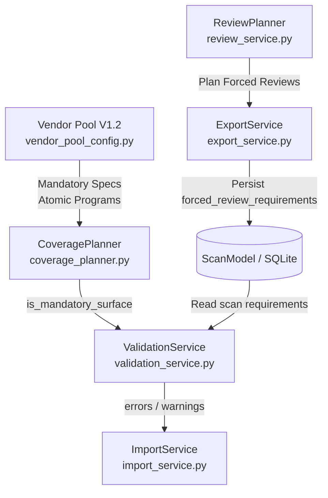

# AI Benefit Desk V0.1

个人 AI 福利监控系统的本地长期数据层与真理层（Source of Truth），与 ChatGPT Web Research 配合使用。

---

## 📖 核心职责分工

- **ChatGPT 负责**：
  - 外部 Web 搜索与深度调查
  - 官方第一方证据寻找（S / A 级）
  - 状态判断、去重建议、线索聚类与漏检复盘
  - 按《AI Benefit Data Exchange Protocol V0.1》生成标准 `AI-Benefit-Scan-Import.json`
- **AI Benefit Desk 负责**：
  - 本地长期持久化与真理层（Source of Truth）
  - 永久唯一 ID 分配（`BEN-xxxxxx`, `LEAD-xxxxxx`, `SRC-xxxxxx`, `COV-xxxxxx`, `MCHK-xxxxxx`, `SCAN-YYYYMMDD-xxx`）
  - 扫描上下文裁剪导出（`AI-Benefit-Scan-Context.json`）
  - 严格门禁校验（Protocol/Schema、基线版本、幂等性、Evidence Gate、Coverage Gate、REVIEW_NOT_DUE、CREATE去重）
  - 单事务原子写入与全量审计（`import_audits`）
  - 物理隔离用户个人操作状态（`user_benefit_states`，导入绝不覆盖）
  - 全中文用户界面与行动看板

---

## 🏛️ 规约依据 (Canonical Sources)

本项目严格遵循以下 5 个正式规约：
1. `AI 福利监控规则 V1.2.1` (V1.2.1)
2. `Vendor Pool V1.2` (V1.2 Final)
3. `Search Playbook V1.2.2` (V1.2.2 Final)
4. `Benefit Schema V1.2.1` (V1.2.1 Final)
5. `AI Benefit Data Exchange Protocol V0.1` (V0.1)

---

## 🚀 快速启动

### 1. 安装依赖
```bash
pip install -r requirements.txt
```

### 2. 运行应用
```bash
streamlit run app.py
```
启动后在浏览器打开本地服务（默认 `http://localhost:8501`）。

### 3. 运行自动化测试
```bash
pytest tests/ -v
```

---

## 📁 项目结构

```text
AI_Benefit_Randar/
├── app.py                      # Streamlit 主入口
├── pages/                      # 8 大纯中文页面
│   ├── 01_总览.py               # 首页关键行动指标与待办
│   ├── 02_福利库.py             # 已确认福利列表、多维筛选与个人状态维护
│   ├── 03_线索队列.py           # 未充分验证线索管理与升级/驳回
│   ├── 04_覆盖记录.py           # 最新覆盖矩阵与完整历史事件流
│   ├── 05_官方入口库.py         # Canonical Sources 官方入口管理
│   ├── 06_建议人工检查.py       # 盲区核查任务与结果录入
│   ├── 07_扫描结果导入.py       # JSON 上传、门禁校验、中文预览与单事务入库
│   └── 08_扫描上下文导出.py     # 规范上下文裁剪导出与文件下载
├── ai_benefit_desk/
│   ├── config.py               # 基础配置与版本常量
│   ├── db/
│   │   ├── database.py         # SQLite 数据库引擎与 Session 工厂
│   │   ├── models.py           # SQLAlchemy 9 张表的 ORM 模型
│   │   └── init_db.py          # 数据库初始化与初始基线种子
│   ├── schemas/
│   │   ├── benefit_models.py   # Benefit Schema V1.2.1 Pydantic 校验模型
│   │   └── protocol_models.py  # Protocol V0.1 导入/导出 Pydantic 模型
│   ├── services/
│   │   ├── id_service.py       # 永久 ID 生成与 local_ref 事务映射
│   │   ├── validation_service.py # 协议/Schema/Evidence/Coverage 门禁校验器
│   │   ├── dedup_service.py    # CREATE 疑似重复检测服务
│   │   ├── review_service.py   # 到期复查与指标统计服务
│   │   ├── export_service.py   # 上下文裁剪与导出服务
│   │   ├── import_service.py   # 导入编排、预览与事务写入
│   │   ├── coverage_planner.py # Coverage 规划服务 (委托 VendorPoolConfig)
│   │   └── vendor_pool_config.py # Vendor Pool V1.2 运行时配置 (Source of Truth)
│   └── utils/
│       ├── enum_labels.py      # 英文内部枚举 -> 中文展示映射
│       ├── date_utils.py       # 日期格式化与到期判定
│       └── json_utils.py       # JSON 序列化工具
├── tests/
│   ├── conftest.py             # 测试夹具 (内存 SQLite)
│   ├── test_benefit_desk.py    # TEST-001 ~ TEST-059 全量单测
│   ├── test_compliance.py      # Golden Fixture 与 Protocol 规约合规测试
│   ├── test_e2e_lifecycle.py   # 生命周期 A~E 端到端测试
│   ├── test_final_compliance.py # Vendor-specific / Warning / Forced Review 最终合规测试
│   └── test_protocol_strict_hardening.py # 严格 Discriminated Union 与 Coverage Gate 测试
├── data/
│   └── benefit_desk.db         # 本地 SQLite 数据文件
├── README.md                   # 项目说明
└── requirements.txt            # 项目依赖
```

---

## 🏗️ Coverage & Review Architecture



**核心设计原则**：

1. **Mandatory Surface 判定**：
   - Mandatory Surface 来自 `VendorPoolConfig` 规范注册（非全局关键词猜测）。
   - **原子粒度 (Atomic Granularity)**：`PROGRAMS` 不是粗粒度遮蔽伞，而是细化为 `PROGRAM_STUDENT`、`PROGRAM_STARTUP`、`PROGRAM_RESEARCH`、`PROGRAM_DEVELOPER`、`PROGRAM_OPEN_SOURCE` 等独立原子项。
   - `NOT_CHECKED` + mandatory → 必须 `SCAN_INCOMPLETE`，严禁 `PUBLIC_COMPLETE`。
   - `NOT_CHECKED` + optional → `NON_MANDATORY_NOT_CHECKED` 结构化警告，不阻断。
   - `NOT_CHECKED` + UNKNOWN → `COVERAGE_CRITICALITY_UNKNOWN` 警告，不假设也不阻断。

2. **BLIND_SPOT 语义**：
   - 针对控制台、桌面端或内部渠道（如 `HIDDEN_ACCOUNT`），若公开 Web 不可观测，标记为 `BLIND_SPOT`，允许 `PUBLIC_COMPLETE` + `OVERALL_PARTIAL` 成立。

3. **Forced Early Review 闭环**：
   - 信号源自 `ReviewPlanner`（从待复查线索、已废弃信源、争议福利等事实推导）。
   - 信号随扫描批次持久化至 `ScanModel.forced_review_requirements`，进程重启/多 Worker 间完全一致。
   - 必须精确匹配完整 Coverage Key (`vendor`, `product`, `surface`, `region`)。
   - 存在强制提前复查要求时，即使未到 `next_review_at`，亦严禁使用 `REVIEW_NOT_DUE`。

4. **Initial Baseline 语义 (CREATE ≠ NEW)**：
   - 首次建立基线时，既有历史福利显式携带 `UNKNOWN` 保持 `UNKNOWN`；合法新推福利携带 `NEW` 保持 `NEW`。
   - Desk 绝不静默篡改事实。

---

## 🧪 自动化测试验证 (130 Tests — Protocol Regression & Lifecycle & Strict Compliance)

- `TEST-001`: 首次 EMPTY Context 可以正常导出
- `TEST-002`: CREATE Benefit 入库后生成永久 benefit_id
- `TEST-003`: UPDATE 不存在 benefit_id → FAIL
- `TEST-004`: 相同 scan_id 二次导入 → 被阻止 (幂等性)
- `TEST-005`: baseline_revision 冲突 → 被发现并阻断
- `TEST-006`: REVIEW_NOT_DUE 不刷新 actual_checked_at
- `TEST-007`: DEEP_FULL_SCAN Import 中 REVIEW_NOT_DUE → FAIL
- `TEST-008`: CONFIRM_NO_CHANGE 必须引用合法已存在 benefit_id
- `TEST-009`: CONFIRMED 没有 S/A Evidence → Evidence Gate 警告与阻断
- `TEST-010`: Lead 可以 resolve 到同一 Import 中的新 Benefit (`local_ref`)
- `TEST-011`: Lead 可以 resolve 到已有 Benefit (`benefit_id`)
- `TEST-012`: Source DEPRECATE 不物理删除历史
- `TEST-013`: Scan Import 绝不修改用户个人操作状态 (`CLAIMED`)
- `TEST-014`: CREATE 疑似重复 → 进入预览，不自动创建
- `TEST-015`: 事务中途失败 → 整体原子 rollback
- `TEST-016`: 首次 Baseline 合法 NEW 保留为 NEW (不自动篡改为 UNKNOWN，CREATE ≠ NEW)
- `TEST-017`: 用户所有可见主要状态显示中文
- `TEST-018`: 未导出的未知 scan_id → FAIL
- `TEST-019`: EMPTY Baseline 要求 BUILD_INITIAL_BASELINE
- `TEST-020`: READY Baseline 拒绝 BUILD_INITIAL_BASELINE
- `TEST-021`: 非法 package_type 被严格拒绝
- `TEST-022`: 非法 Protocol 枚举值 Schema 级别阻断
- `TEST-023`: Protocol 事件时间强制要求带时区 ISO8601
- `TEST-024`: Vendor Pool mandatory surface 为 NOT_CHECKED 时要求 SCAN_INCOMPLETE 且禁止 PUBLIC_COMPLETE
- `TEST-025`: Scan Context 导出包含完整 benefit_index 身份字段
- `TEST-026`: Vendor Deep Dive 正确裁剪 User Benefit State
- `TEST-027`: 同一 Import 内 local_ref 全局唯一性校验 (跨类型)
- `TEST-028`: Manual Check 引用不存在的 Benefit/Lead 校验阻断
- `TEST-029`: BenefitRecord 包含多余字段 (extra=forbid) 阻断
- `TEST-030`: scan_id 与 baseline_revision_at_export 强绑定校验
- `TEST-031`: 初始基线全生命周期测试 (EMPTY -> Export -> Import -> READY -> rev+1 -> 幂等阻断)
- `TEST-032`: REVIEW_NOT_DUE 必须依赖明确 next_review_at (null / UNKNOWN 阻断，严格未来日期通过且不刷新 actual_checked_at)
- `TEST-033`: NOT_CHECKED 与 BLIND_SPOT 正确持久化 NULL actual_checked_at 且 CHECKED_NONE 缺 actual_checked_at 阻断
- `TEST-034`: Source ADD 必须提供 last_verified_at 时间戳 (缺失 → Validation FAIL)
- `TEST-035`: 新建 Manual Check 必须使用 local_ref，严禁外部自定义永久 manual_check_id
- `TEST-036 ~ TEST-059`: 增量 patch 合并校验、Lead 终态防护、Source Schema、amount 语义、Dedup 等
- **Vendor Pool Canonical Coverage**: 覆盖 OpenAI、Anthropic、Google、Microsoft、GitHub、Qoder、Kimi、MiniMax、Mistral AI、Meta、ByteDance、Alibaba、Tencent、TRAE、Cursor、Windsurf、DeepSeek、xAI、Perplexity、Zhipu 等全矩阵
- **Program Atomicity Tests**: 单独满足 `PROGRAM_STUDENT` 不能视为完成其他必查 Program
- **BLIND_SPOT Semantics**: 验证控制台不可观测渠道合法支持 `PUBLIC_COMPLETE` + `OVERALL_PARTIAL`
- **Planner-Driven Forced Review Tests**: 规划层产生信号 → `ScanModel` 持久化 → 校验层阻断 `REVIEW_NOT_DUE` → 重启/重载后持久生效
- **Initial Baseline NEW Semantics**: UNKNOWN 保持、合法 NEW 保留、CREATE ≠ NEW
- **Warning Extensibility**: 已知类型 PASS、未知但合法类型 PASS、空类型 FAIL
- **E2E Lifecycles**: 生命周期 A~E 全流程测试 PASS
- **Real Fixture E2E**: `AI-Benefit-Scan-Import-SCAN-20260818-001.json` (112 Benefits + 9 Leads + 92 Sources + 340 Coverage + 11 Manual Checks) 预览与提交回归 PASS


